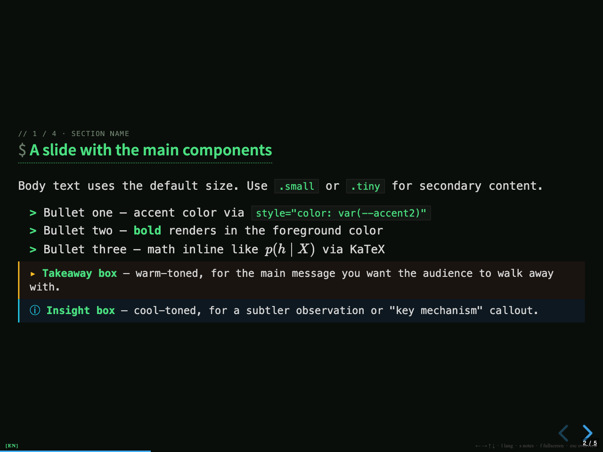
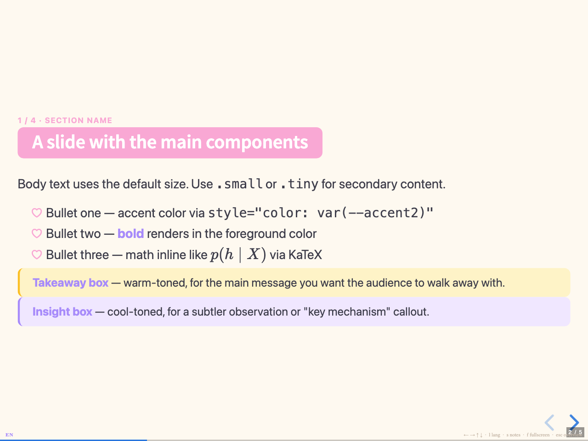

# Templates

Drop-in design alternatives for `slides.html`. Each file is self-contained — pick the one you like and copy it over `slides.html`:

```bash
cp templates/light.html slides.html
```

All templates share the same DOM structure and component classes (`.takeaway`, `.insight`, `.twocol`, `.eq-block`, `table.compare`, `.fig-card`, `.label`, etc.) and the same bilingual `lang-ja` / `lang-en` switching (press `l` at runtime, or pass `?lang=en` / `?lang=ja` in the URL). Only the `<style>` block and the reveal.js base theme (`black.css` vs `white.css`) differ.

## Previews

Each preview shows slide 2 (the components sampler) rendered in English at 1280×960.

### dark — high-contrast dark theme (default)


Black background with red/teal accents and gold/blue side bars on the callout boxes. Reads well in dim rooms; figures look most striking when framed with the `.fig-card` white box.

### light — clean professional theme


White background with rust and navy accents. Good for general talks where audience lighting is variable. Comparable in feel to a Notion or Google Slides deck.

### academic — paper-flavored serif theme


Cream background, Crimson Pro / Georgia serif, italic h2 with a thin burgundy rule. Conservative palette (burgundy + forest green). Suits academic talks, defense slides, and decks that go alongside a paper.

### minimal — typography-only theme


Pure white, monochrome, no boxes or rounded corners. Lists use em-dash markers instead of bullets, callout boxes degrade to thin left rules, and the `.label` pill becomes an outlined tag. Maximum focus on words.

### terminal — monospace shell aesthetic



Deep black background, bright green primary and cyan secondary, monospace throughout. h2 picks up a leading `$`, h3 a `#`, lists a `>`, and the language badge becomes `[EN]` / `[JA]`. Built for dev-talk and tooling decks; expect to lean on `code` and `kbd` a lot.

### pastel — friendly workshop theme



Warm cream background with pink and lavender accents, generous border radii, and heart-shaped bullet markers. h2 becomes a rounded pink pill, callout boxes get soft cream / lavender fills. Suits workshops, LTs, internal show-and-tells, and anything that should not feel corporate.

## Regenerating the previews

```bash
bash scripts/screenshot.sh
```

Uses macOS Google Chrome in headless mode. Customize via env vars:

| Variable | Default | Notes |
|---|---|---|
| `CHROME` | `/Applications/Google Chrome.app/Contents/MacOS/Google Chrome` | Path to the Chrome binary. |
| `SLIDE_INDEX` | `1` | 0=title, 1=components, 2=twocol, 3=eq+table, 4=figure. |
| `LANG_PARAM` | `en` | `en` or `ja`. |
| `PORT` | `8765` | Local server port. |

## Keeping templates in sync

Because each template is a self-contained HTML file, edits to the sample slide DOM (new components, restructured layouts, updated copy) have to land in every variant. The repo treats `templates/dark.html` as the canonical body source and provides a sync script:

```bash
# Edit templates/dark.html, then:
bash scripts/sync-templates.sh
```

The script replaces the `<body>...</html>` section of every other `templates/*.html` and `slides.html` with the body from `templates/dark.html`, preserving each target's own `<style>` block and theme link. Override the source via env var if you'd rather drive sync from another template:

```bash
SOURCE=templates/light.html bash scripts/sync-templates.sh
```

After syncing, regenerate previews to keep the screenshots fresh:

```bash
bash scripts/screenshot.sh
```

## Customizing further

Each template's `<style>` block defines its full palette under `:root` (`--bg`, `--fg`, `--muted`, `--accent`, `--accent2`, `--soft`, `--warm`, `--cool`, plus border variants). Most visual tweaks fit there. For larger changes (typography, layout density, callout shape), edit the corresponding rules below the `:root` block.

The `<body>` content is identical across templates, so you can hot-swap themes during early authoring without rewriting any slide markup.
