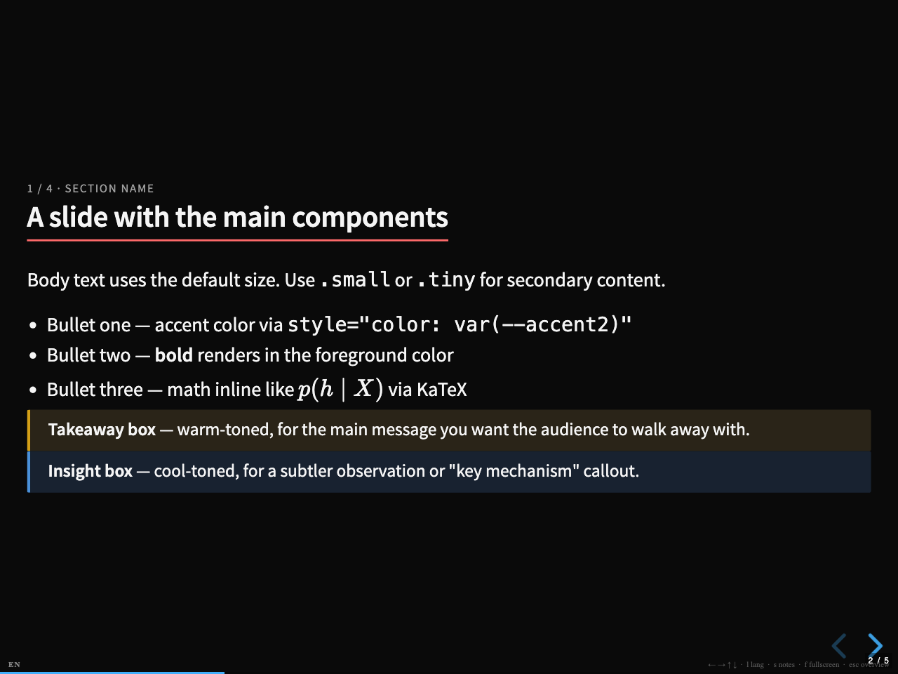
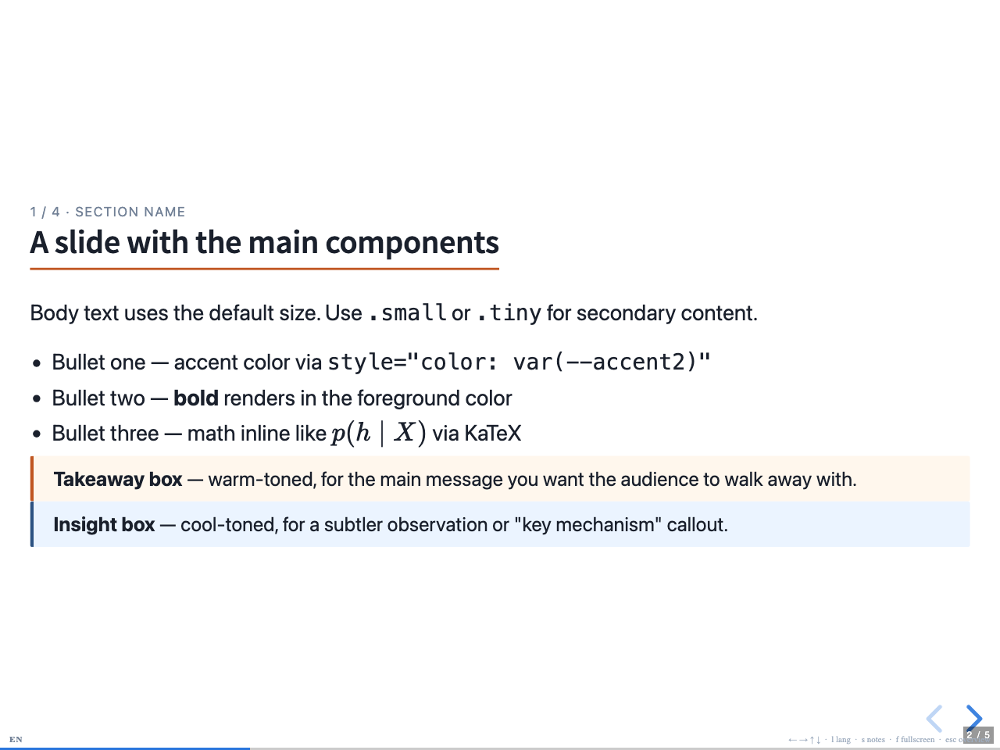
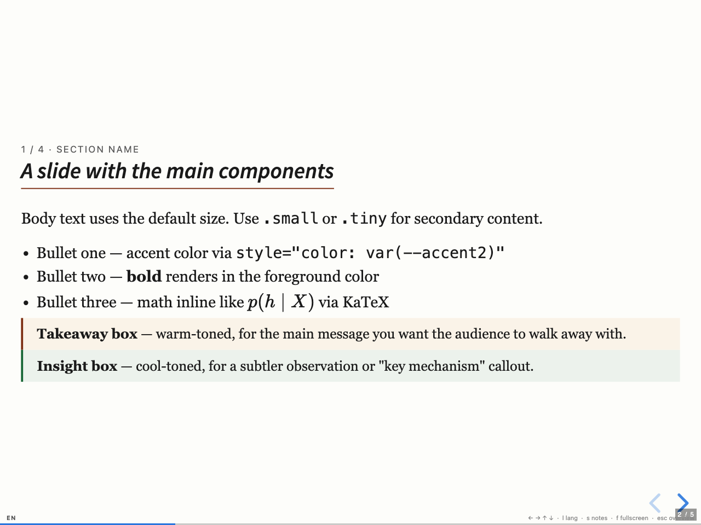
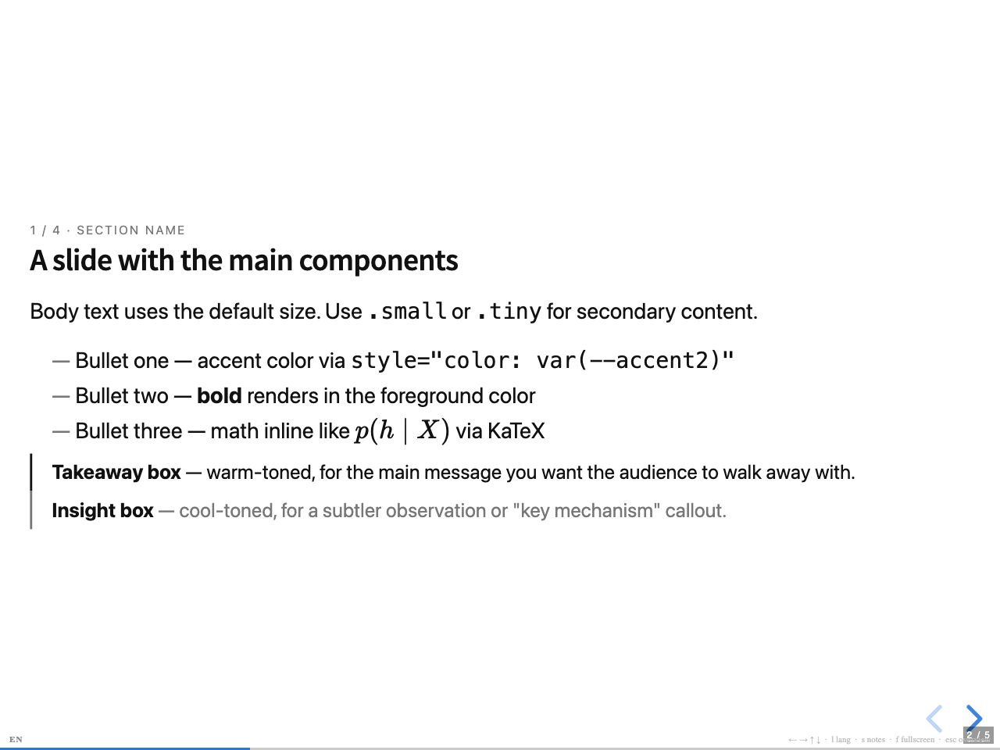

# Templates

Drop-in design alternatives for `slides.html`. Each file is self-contained — pick the one you like and copy it over `slides.html`:

```bash
cp templates/light.html slides.html
```

All templates share the same DOM structure and component classes (`.takeaway`, `.insight`, `.twocol`, `.eq-block`, `table.compare`, `.fig-card`, `.label`, etc.) and the same bilingual `lang-ja` / `lang-en` switching (press `l` at runtime, or pass `?lang=en` / `?lang=ja` in the URL). Only the `<style>` block and the reveal.js base theme (`black.css` vs `white.css`) differ.

## Previews

Each preview shows slide 2 (the components sampler) rendered in English at 1280×960.

### dark — high-contrast dark theme (default)



Black background with red/teal accents and gold/blue side bars on the callout boxes. Reads well in dim rooms; figures look most striking when framed with the `.fig-card` white box.

### light — clean professional theme



White background with rust and navy accents. Good for general talks where audience lighting is variable. Comparable in feel to a Notion or Google Slides deck.

### academic — paper-flavored serif theme



Cream background, Crimson Pro / Georgia serif, italic h2 with a thin burgundy rule. Conservative palette (burgundy + forest green). Suits academic talks, defense slides, and decks that go alongside a paper.

### minimal — typography-only theme



Pure white, monochrome, no boxes or rounded corners. Lists use em-dash markers instead of bullets, callout boxes degrade to thin left rules, and the `.label` pill becomes an outlined tag. Maximum focus on words.

## Regenerating the previews

```bash
bash scripts/screenshot.sh
```

Uses macOS Google Chrome in headless mode. Customize via env vars:

| Variable | Default | Notes |
|---|---|---|
| `CHROME` | `/Applications/Google Chrome.app/Contents/MacOS/Google Chrome` | Path to the Chrome binary. |
| `SLIDE_INDEX` | `1` | 0=title, 1=components, 2=twocol, 3=eq+table, 4=figure. |
| `LANG_PARAM` | `en` | `en` or `ja`. |
| `PORT` | `8765` | Local server port. |

## Customizing further

Each template's `<style>` block defines its full palette under `:root` (`--bg`, `--fg`, `--muted`, `--accent`, `--accent2`, `--soft`, `--warm`, `--cool`, plus border variants). Most visual tweaks fit there. For larger changes (typography, layout density, callout shape), edit the corresponding rules below the `:root` block.

The `<body>` content is identical across templates, so you can hot-swap themes during early authoring without rewriting any slide markup.
